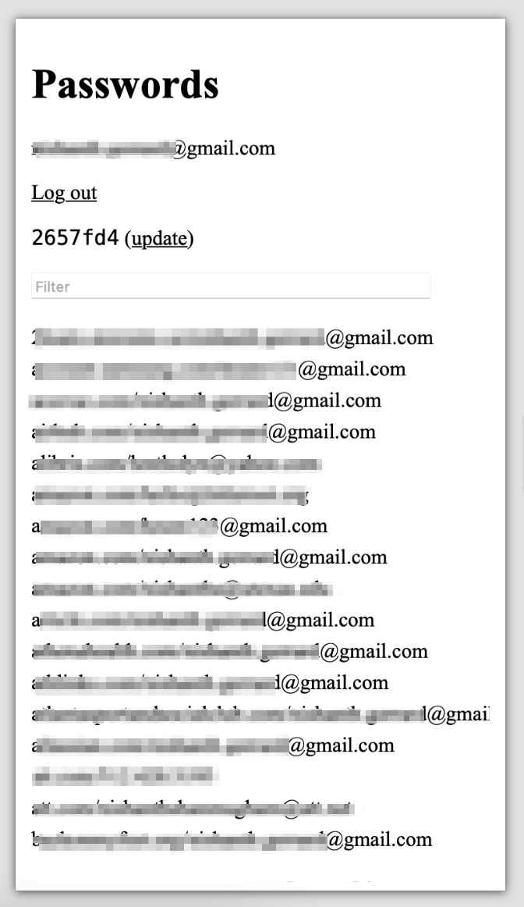

## passweb

A web user interface for [pass][1]. The web interface is served by a Go
server.

## SECURITY WARNING

`passweb` serves content over HTTP, _not_ HTTPS. If you plan to serve
`passweb`'s content on the Internet, you should set up a HTTPS reverse proxy
that terminates TLS and forwards requests to `passweb`.

## Install

Requires Go version 1.16 or higher to build.

```
go install github.com/littleroot/passweb@latest
```

## Overview

The `passweb` command starts a web server, which serves a web interface to
securely access `pass` passwords. To get started, run `passweb` and provide a
config file.  See `conf.toml.example` for an example config file. All fields
in the config file are required.

```
passweb conf.toml
```



The GPG keys used by `pass` must be located in the default GPG homedir:
`~/.gnupg`.  The SSH keys for Git operations (such as cloning) should be in
the location specified by `SSHPrivateKeyFile` in the config file.

Only Google accounts specified in `AllowedEmails` in the config file may
access the interface. (The GPG passphrase used by `pass` is always required in
addition to this requirement to view each password.)

## Runtime Requirements

```
- pass
- git
- ssh
- gpg
```

## License

MIT

[1]: http://passworstore.org
